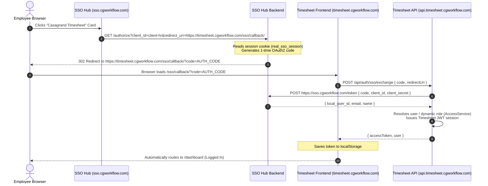

# Casagrand Timesheet — Single Sign-On (SSO) & User Synchronization Guide

This document provides the complete engineering specifications for **Single Sign-On (SSO)**, **Auto-Login**, and **User Synchronization** in the **Casagrand Timesheet Portal** (`@hr-portal`), integrated with the **Casa One Login SSO Hub** (`https://sso.cgworkflow.com`) and **Keycloak Identity Provider** (`https://auth.cgworkflow.com`).

---

## 🏛 System Architecture & Endpoints

| Component | Production Domain | Dev Port | Description |
| :--- | :--- | :--- | :--- |
| **SSO Hub UI** | `https://sso.cgworkflow.com` | `:3110` | Central corporate app launcher, SES OTP reset & activation |
| **SSO Hub Backend** | `https://sso.cgworkflow.com` | `:5160` | OAuth2 Authorization Server (`/authorize`, `/token`) |
| **Keycloak IdP** | `https://auth.cgworkflow.com` | `:8181` | Realm `digilogy-sso`, OIDC credentials & PIN authentication |
| **Timesheet Frontend**| `https://timesheet.cgworkflow.com`| `:3661` | Next.js Static Export on AWS S3 + CloudFront |
| **Timesheet API** | `https://api.timesheet.cgworkflow.com`| `:5111` | Node.js Express API on AWS ECS Fargate |

---

## ⚡ 1-Click Auto-Login Flow

When an authenticated employee clicks the **Casagrand Timesheet** application card on `https://sso.cgworkflow.com`, they are automatically logged into the Timesheet portal **without re-entering their email or PIN**:



---

## 🚀 Guide: How to Implement SSO on a NEW Application

To connect any new company application (e.g., CRM, Procurement, Site Ops) to the Casa One SSO ecosystem, follow these **4 steps**:

### Step 1: Register Client in Keycloak & SSO Hub

1. **Keycloak Realm Admin** (`https://auth.cgworkflow.com/admin/`):
   - Realm: **`digilogy-sso`**
   - Create Client: `client-<app-name>` (e.g. `client-crm`)
   - Client Authentication: `ON` (Confidential)
   - Standard Flow: `Enabled`
   - Direct Access Grants: `Enabled`
   - Valid Redirect URIs:
     - `https://<app-domain>/sso/callback/`
     - `https://<app-domain>/*`
     - `http://localhost:<PORT>/sso/callback/` *(dev)*
   - Web Origins: `https://<app-domain>`, `+`
   - Save and copy the generated **Client Secret** from the **Credentials** tab.

2. **SSO Hub Backend Configuration** (`sso-hub/apps/backend/src/routes/oauth.ts`):
   ```typescript
   const CLIENTS = {
     "client-crm": {
       secret: process.env.CRM_CLIENT_SECRET || "secret-crm-production",
       redirect: () => `${process.env.CRM_FRONTEND_URL}/sso/callback/`,
       allowedRedirects: () => [
         "https://crm.cgworkflow.com/sso/callback/",
         "http://localhost:3000/sso/callback/"
       ],
       appId: "crm",
     },
   };
   ```

3. **SSO Hub App Catalog** (`sso-hub/apps/backend/src/lib/keycloak.ts`):
   ```typescript
   export const APPS = [
     {
       appId: "crm",
       name: "Casagrand CRM",
       clientId: "client-crm",
       frontendUrl: () => process.env.CRM_FRONTEND_URL ?? "https://crm.cgworkflow.com",
       icon: "/icons/crm.png",
       jit: true,
     },
   ];
   ```

---

### Step 2: Implement Backend SSO Routes in the New Application

Your application backend must implement **3 endpoints**:

#### 1. OAuth2 Code Exchange: `POST /api/auth/sso/exchange`
Exchanges the single-use code received by your frontend callback for the user's verified identity:
```typescript
app.post("/api/auth/sso/exchange", async (req, res) => {
  const { code, redirectUri } = req.body;

  // 1. Call SSO Hub token exchange
  const hubRes = await fetch("https://sso.cgworkflow.com/token", {
    method: "POST",
    headers: { "Content-Type": "application/json" },
    body: JSON.stringify({
      grant_type: "authorization_code",
      code,
      client_id: "client-crm",
      client_secret: process.env.SSO_CLIENT_SECRET,
      redirect_uri: redirectUri,
    }),
  });

  if (!hubRes.ok) {
    return res.status(401).json({ error: "Invalid or expired SSO authorization code" });
  }

  const { local_user_id, email, name, auth_user_id } = await hubRes.json();

  // 2. Resolve local user record & dynamic permissions
  let user = await userRepository.findByEmail(email);
  if (!user) {
    user = await userRepository.create({ email, name });
  }

  // 3. Issue your application's JWT session
  const token = jwt.sign(
    { id: user.id, email: user.email, role: user.role },
    process.env.JWT_SECRET,
    { expiresIn: "8h" }
  );

  return res.json({ token, user });
});
```

#### 2. Internal Lookup Endpoint: `POST /api/auth/internal/sso/lookup`
Used by the SSO Hub during login gate checks to verify if the employee exists in your application:
- **Header:** `x-provision-secret: <SHARED_SECRET>`
- **Request:** `{ "email": "employee@casagrand.co.in" }`
- **Response (200 OK):**
  ```json
  {
    "found": true,
    "inEmployeeDirectory": true,
    "localUserId": "105",
    "email": "employee@casagrand.co.in",
    "name": "Hari Narayan"
  }
  ```

#### 3. Internal JIT Provisioning Endpoint: `POST /api/auth/internal/sso/provision`
Allows the SSO Hub to automatically provision the user into your local database:
- **Header:** `x-provision-secret: <SHARED_SECRET>`
- **Request:**
  ```json
  {
    "email": "employee@casagrand.co.in",
    "name": "Hari Narayan",
    "pin": "1234",
    "authUserId": "keycloak-sub-uuid"
  }
  ```
- **Response (200 OK):**
  ```json
  {
    "localUserId": "105"
  }
  ```

---

### Step 3: Implement Frontend Callback Route (`/sso/callback`)

In your application frontend (e.g. Next.js, React, Vue):

```tsx
// src/app/sso/callback/page.tsx
"use client";

import { useEffect, useState } from "react";
import { useRouter, useSearchParams } from "next/navigation";

export default function SsoCallbackPage() {
  const router = useRouter();
  const searchParams = useSearchParams();
  const [error, setError] = useState<string | null>(null);

  useEffect(() => {
    const code = searchParams.get("code");
    if (!code) {
      setError("No authorization code provided");
      return;
    }

    async function completeLogin() {
      try {
        const res = await fetch("/api/auth/sso/exchange", {
          method: "POST",
          headers: { "Content-Type": "application/json" },
          body: JSON.stringify({
            code,
            redirectUri: window.location.origin + "/sso/callback/",
          }),
        });

        if (!res.ok) throw new Error("SSO exchange failed");

        const data = await res.json();
        // Save application token
        localStorage.setItem("authToken", data.token);
        // Navigate directly to app dashboard
        router.replace("/dashboard");
      } catch (err: any) {
        setError(err.message || "Failed to complete SSO login");
      }
    }

    completeLogin();
  }, [searchParams, router]);

  if (error) {
    return <div className="error-screen"><p>Login Error: {error}</p><a href="https://sso.cgworkflow.com">Back to SSO Hub</a></div>;
  }

  return <div className="loading-screen"><p>Logging you into Casagrand Timesheet...</p></div>;
}
```

---

## 🔄 User Synchronization Lifecycle

The synchronization architecture consists of three tiers:

```text
┌──────────────────────────────────────┐
│       EmployeeData (Postgres)        │  <-- Master Roster (Official Email, Dept, Role)
└──────────────────┬───────────────────┘
                   │
                   ▼  [1. Initial / Periodic Sync via npm run sync:sso]
┌──────────────────────────────────────┐
│        Keycloak (Postgres)           │  <-- IdP Credentials, PIN Hashes & Status
│      (Realm: digilogy-sso)           │
└──────────────────┬───────────────────┘
                   │
                   ▼  [2. Just-In-Time (JIT) Sync via /provision]
┌──────────────────────────────────────┐
│            User (Postgres)           │  <-- Local App User (Timesheet Owner)
│     (Dynamic Roles: Admin/HRBP/Mgr)  │
└──────────────────────────────────────┘
```

### 1. Bulk Initial Synchronization (`npm run sync:sso`)
To sync all employees from `EmployeeData` into Keycloak:
```bash
cd apps/api_hr_portal
npm run sync:sso
```
- Queries all active employees.
- Creates accounts in Keycloak with `enabled: true`.
- Sets attributes: `employeeId`, `department`, `mobileNumber`, `zone`.
- Deactivates accounts if `employmentStatus === 'Terminated'`.
- Idempotent: Never overwrites existing user passwords or PINs.

### 2. Just-In-Time (JIT) Provisioning
When an employee signs into SSO Hub for the first time:
- Email lookup verifies employee in `EmployeeData`.
- Employee verifies via 6-digit AWS SES OTP and sets their 4-digit PIN.
- Hub calls `/provision` to ensure local `User` record exists with their PIN.

### 3. Dynamic Organizational Role Resolution (`npm run sync:roles`)
Roles in Timesheet are dynamically resolved using organizational reporting lines:
- **`ADMIN`**: Corporate system administrators or designated superadmins.
- **`HRBP`**: When the employee ID appears in `EmployeeData.hrbpEmployeeId`.
- **`MANAGER`**: When the employee ID appears in `EmployeeData.directManagerEmployeeId`.
- **`EMPLOYEE`**: All individual contributors.

To re-sync and recalculate roles for all users at once:
```bash
cd apps/api_hr_portal
npm run sync:roles
```

---

## 🔒 Security Configuration Reference

| Secret / Config | Storage Location | Description |
| :--- | :--- | :--- |
| `x-provision-secret` | AWS Secrets Manager / ECS | Shared inter-service authentication header |
| `SSO_CLIENT_SECRET` | ECS Task Environment | Secret for `client-hr` OAuth2 token exchange |
| `JWT_SECRET` | AWS Secrets Manager | Signer for Timesheet application session tokens |
| `SES_FROM_EMAIL` | `app@cgworkflow.com` | Verified AWS SES production sender address |
