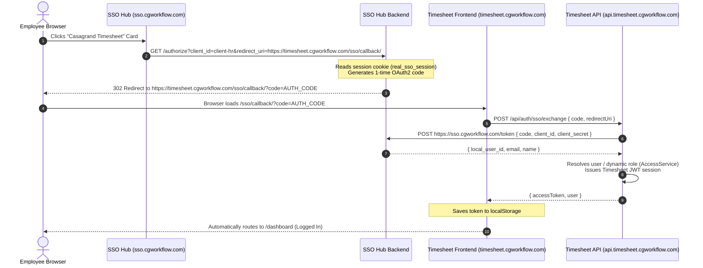

# Casagrand Timesheet — Single Sign-On (SSO) & User Synchronization Guide

This document is the official engineering guide for **Single Sign-On (SSO)**, **Auto-Login**, and **User Synchronization** in the **Casagrand Timesheet Portal** (`@hr-portal`), integrated with **Casa One Login SSO Hub** (`https://sso.cgworkflow.com`) and **Keycloak Identity Provider** (`https://auth.cgworkflow.com`).

---

## 🏛 System Architecture & Production Endpoints

| Component | Production Domain | Port (Dev) | Description |
| :--- | :--- | :--- | :--- |
| **SSO Hub UI** | `https://sso.cgworkflow.com` | `:3110` | Central corporate app launcher, SES OTP reset & activation |
| **SSO Hub Backend** | `https://sso.cgworkflow.com` | `:5160` | OAuth2 Authorization Server (`/authorize`, `/token`) |
| **Keycloak IdP** | `https://auth.cgworkflow.com` | `:8181` | Realm `digilogy-sso`, OIDC credentials & PIN authentication |
| **Timesheet Frontend**| `https://timesheet.cgworkflow.com`| `:3661` | Next.js Static Export on S3 + CloudFront |
| **Timesheet API** | `https://api.timesheet.cgworkflow.com`| `:5111` | Node.js Express API on AWS ECS Fargate |

---

## ⚡ 1-Click Auto-Login Architecture

When an authenticated employee clicks the **Casagrand Timesheet** application card on `https://sso.cgworkflow.com`, they are automatically logged into the Timesheet portal **without re-entering their email or PIN**:



---

## 🚀 How to Onboard a NEW Application into Casa One SSO

To connect any additional company application (e.g., CRM, Procurement, Site Management) to the Casa One SSO ecosystem, follow these **4 steps**:

### Step 1: Register Client in Keycloak

1. Navigate to Keycloak Admin Console: `https://auth.cgworkflow.com/admin/`.
2. Select realm **`digilogy-sso`**.
3. Under **Clients** > **Create Client**:
   - **Client ID**: `client-<app-name>` (e.g. `client-crm`)
   - **Client Authentication**: `ON` (Confidential)
   - **Standard Flow**: `Enabled`
   - **Direct Access Grants**: `Enabled`
   - **Valid Redirect URIs**:
     - `https://<app-domain>/sso/callback/`
     - `https://<app-domain>/*`
     - `http://localhost:<PORT>/sso/callback/` *(dev)*
   - **Web Origins**:
     - `https://<app-domain>`
     - `http://localhost:<PORT>`
     - `+`
4. Under **Credentials**, copy the **Client Secret**.

---

### Step 2: Register Client in SSO Hub Backend

In `sso-hub/apps/backend/src/routes/oauth.ts`:
```typescript
const CLIENTS = {
  // Existing Timesheet client
  "client-hr": {
    secret: "secret-hr-demo",
    redirect: () => `${process.env.HR_FRONTEND_URL}/sso/callback/`,
    allowedRedirects: () => [
      "https://timesheet.cgworkflow.com/sso/callback/",
      "http://localhost:3661/sso/callback/"
    ],
    appId: "hr",
  },
  // New Application client
  "client-crm": {
    secret: process.env.CRM_CLIENT_SECRET || "secret-crm-production",
    redirect: () => `${process.env.CRM_FRONTEND_URL}/sso/callback/`,
    allowedRedirects: () => [
      "https://crm.cgworkflow.com/sso/callback/",
      "http://localhost:3000/sso/callback/"
    ],
    appId: "crm",
  },
};
```

In `sso-hub/apps/backend/src/lib/keycloak.ts`:
```typescript
export const APPS = [
  {
    appId: "hr",
    name: "Timesheet",
    clientId: "client-hr",
    frontendUrl: () => process.env.HR_FRONTEND_URL ?? "https://timesheet.cgworkflow.com",
    icon: "/icons/timesheet.png",
    jit: true,
  },
  {
    appId: "crm",
    name: "Casagrand CRM",
    clientId: "client-crm",
    frontendUrl: () => process.env.CRM_FRONTEND_URL ?? "https://crm.cgworkflow.com",
    icon: "/icons/crm.png",
    jit: true,
  },
];
```

---

### Step 3: Implement Internal SSO Endpoints in the App Backend

The new application backend must expose two endpoints secured by header `x-provision-secret`:

#### 1. Lookup: `POST /api/auth/internal/sso/lookup`
Verifies whether the email belongs to an active employee or user.
```json
// Request Body
{ "email": "employee@casagrand.co.in" }

// Response Body (200 OK)
{
  "found": true,
  "inEmployeeDirectory": true,
  "localUserId": "105",
  "email": "employee@casagrand.co.in",
  "name": "John Doe"
}
```

#### 2. JIT Provision: `POST /api/auth/internal/sso/provision`
Provisions the user into the local database if missing.
```json
// Request Body
{
  "email": "employee@casagrand.co.in",
  "name": "John Doe",
  "authUserId": "AUTH-keycloak-sub-uuid"
}

// Response Body (200 OK)
{ "localUserId": "105" }
```

#### 3. Code Exchange: `POST /api/auth/sso/exchange`
Exchanges the single-use code with `https://sso.cgworkflow.com/token`:
```typescript
const res = await fetch("https://sso.cgworkflow.com/token", {
  method: "POST",
  headers: { "Content-Type": "application/json" },
  body: JSON.stringify({
    grant_type: "authorization_code",
    code: req.body.code,
    client_id: "client-crm",
    client_secret: process.env.SSO_CLIENT_SECRET,
    redirect_uri: req.body.redirectUri,
  }),
});
const data = await res.json();
// Returns: { local_user_id, email, name, auth_user_id }
// Then create and return your application's JWT session token!
```

---

### Step 4: Implement Frontend Callback Route (`/sso/callback`)

In your application frontend:
1. Create a page at route `/sso/callback/`.
2. Extract the `?code=...` query parameter.
3. Call `POST /api/auth/sso/exchange { code }`.
4. Store the resulting session token in `localStorage` or secure cookie.
5. Redirect to your application's `/dashboard`.

---

## 🔄 User Synchronization Lifecycle

The synchronization architecture consists of three tiers:

```
┌──────────────────────────────────────┐
│       EmployeeData (Postgres)        │  <-- Master Roster (7,135 Active Records)
│    (Official Email, Dept, Role)      │
└──────────────────┬───────────────────┘
                   │
                   ▼  [1. Initial / Periodic Sync via npm run sync:sso]
┌──────────────────────────────────────┐
│        Keycloak (Postgres)           │  <-- IdP Credentials, PIN Hashes & Status
│      (Realm: digilogy-sso)           │
└──────────────────┬───────────────────┘
                   │
                   ▼  [2. Just-In-Time (JIT) Sync via /provision]
┌──────────────────────────────────────┐
│            User (Postgres)           │  <-- Local App User (Timesheet Owner)
│     (Dynamic Roles: Admin/HRBP/Mgr)  │
└──────────────────────────────────────┘
```

### 1. Bulk Initial Synchronization (`npm run sync:sso`)
To sync all employees from `EmployeeData` into Keycloak:
```bash
cd apps/api_hr_portal
npm run sync:sso
```
* Queries all active employees.
* Creates accounts in Keycloak with `enabled: true`.
* Sets attributes: `employeeId`, `department`, `mobileNumber`, `zone`.
* Deactivates accounts if `employmentStatus === 'Terminated'`.

### 2. Just-In-Time (JIT) Provisioning
When an employee signs into SSO Hub for the first time:
* Email lookup verifies employee in `EmployeeData`.
* Employee verifies via 6-digit AWS SES OTP and sets 4-digit PIN.
* Hub calls `/provision` to ensure local `User` record exists.

### 3. Dynamic Organizational Role Resolution (`npm run sync:roles`)
Roles in Timesheet are dynamically resolved using organizational reporting lines:
- **`ADMIN`**: Corporate system administrators or designated superadmins.
- **`HRBP`**: When the employee ID appears in `EmployeeData.hrbpEmployeeId`.
- **`MANAGER`**: When the employee ID appears in `EmployeeData.directManagerEmployeeId`.
- **`EMPLOYEE`**: All individual contributors.

To re-sync and recalculate roles for all users at once:
```bash
cd apps/api_hr_portal
npm run sync:roles
```

---

## 🔒 Security Configuration Reference

| Secret / Config | Recommended Storage | Description |
| :--- | :--- | :--- |
| `x-provision-secret` | AWS Secrets Manager | Shared inter-service authentication header |
| `SSO_CLIENT_SECRET` | ECS Task Environment | Secret for `client-hr` OAuth2 token exchange |
| `JWT_SECRET` | AWS Secrets Manager | Signer for Timesheet application session tokens |
| `SES_FROM_EMAIL` | `app@cgworkflow.com` | Verified AWS SES production sender address |

---

## 📦 Production Deployment

Both frontend and backend are configured for automated CI/CD via GitHub Actions (`.github/workflows/deploy-production.yml`):

1. **Pushing to `main`**: Automatically triggers building and deploying Docker images to ECR, updating ECS Fargate services (`api`, `reports`, `admin`, `mail-worker`), building static Next.js export, and syncing to S3 + CloudFront with automatic cache invalidation.
2. **Health Verification**: Validated via `https://api.timesheet.cgworkflow.com/api/health`.
